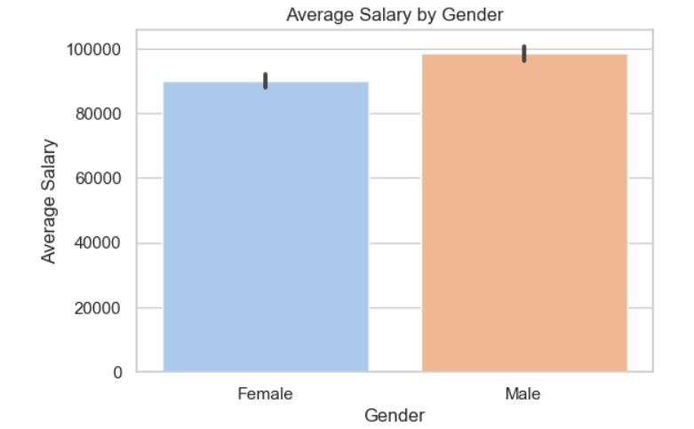
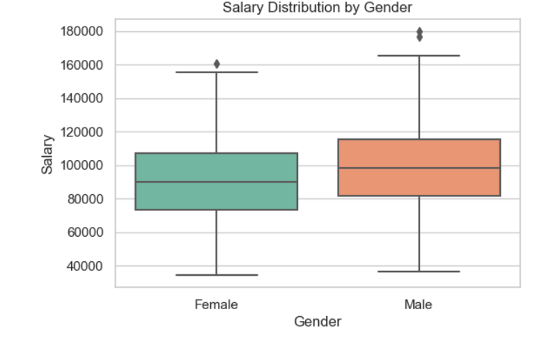

# Gender Pay Gap Analysis

This project analyzes salary differences between male and female employees using the Glassdoor dataset.

## Steps
1. Load and clean data  
2. Calculate average salary by gender  
3. Visualize pay differences  
4. Find the overall gender pay gap percentage  

## Tools Used
- Python  
- Pandas, Numpy  
- Matplotlib, Seaborn  

## How to Run
1. Install requirements  
pip install -r requirements.txt

2. Open the notebook:
Project_3_Gender_Pay_Gap_Analysis.ipynb

## Dataset
Source: [Glassdoor Gender Pay Gap Dataset](https://www.kaggle.com/datasets/nilimajauhari/glassdoor-analyze-gender-pay-gap)

## Visualizations

| Gender Distribution | Salary Comparison |
|----------------------|------------------|
|  |  |
